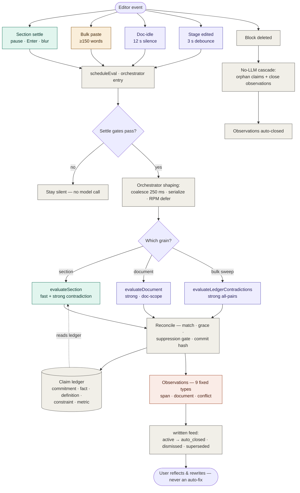

# Evaluation diagrams

Visual references for the text-evaluation system — the "evaluation brain." These are point-in-time
maps of how the pipeline actually works; when you change triggers, timing, evaluator structure, or the
taxonomy, update the source of truth in [`docs/mechanics/evaluation-triggers.md`](../mechanics/evaluation-triggers.md)
first, then refresh these if the shape changed.

| File | What it shows | Open with |
| ---- | ------------- | --------- |
| [`evaluation-flowchart.svg`](evaluation-flowchart.svg) | End-to-end flow: one signal traced from an editor event → trigger → gates → orchestrator → evaluator → ledger/observations → feed. | Any browser / renders inline on GitHub. Light + dark aware. |
| [`evaluation-brain-map.html`](evaluation-brain-map.html) | "Single glance" reference of every part — all triggers, gates, the three evaluator modes with their internal steps, model router tiers, claim ledger, and the full observation taxonomy with its axes and guardrails. | Open in a browser (`open docs/diagrams/evaluation-brain-map.html`). |

The Mermaid version of the flowchart below renders natively on GitHub and is the easiest to keep in sync
by hand.

## End-to-end flow (Mermaid)

Legend — colour encodes the model tier a step invokes: teal = fast (per-section), purple = strong
(doc / conflict), amber = bulk paste, coral = observation output, grey = control & stores (no model call).

## Notes on fidelity

- The single **"settle gates"** node collapses three genuinely different gates that don't all apply to
  every path: terminal punctuation + length (section triggers), the maturity proxy (doc-idle, `nascent`
  stays silent), and the 150-word threshold (the bulk contradiction sweep only).
- The **model-router** fast/strong split is encoded as node colour rather than its own node. The brain
  map has a dedicated router panel.
- **`block-removed`** is the only path that never calls a model — it peels off into the no-LLM cascade.
- The dashed **`reads ledger`** edge is the key feedback loop: contradiction checks read the claim ledger
  instead of re-reading the document (Invariant #3, no per-keystroke full-document scans).
